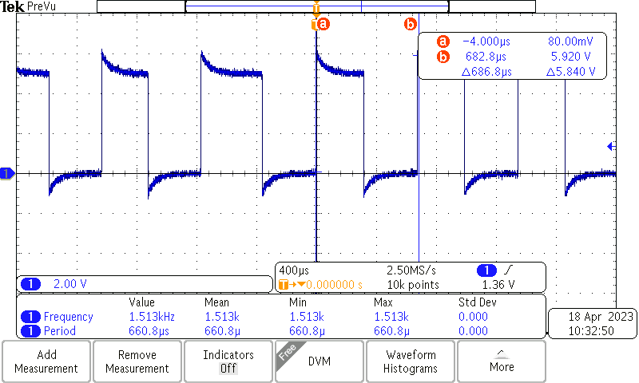
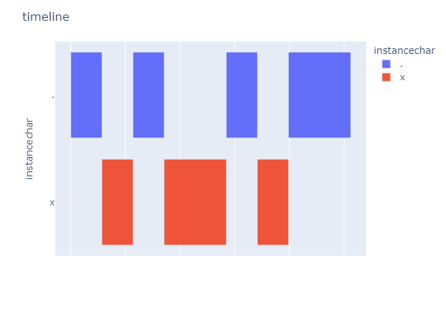
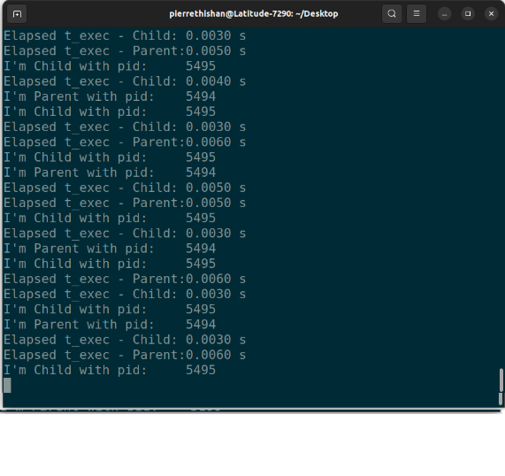
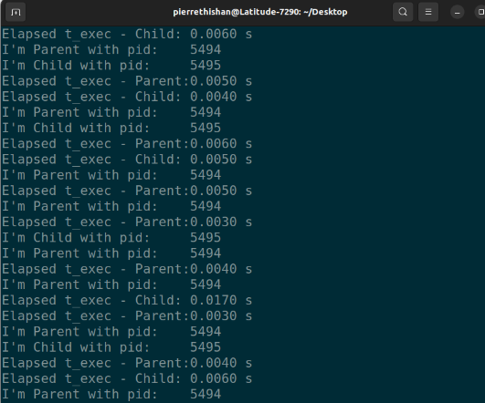
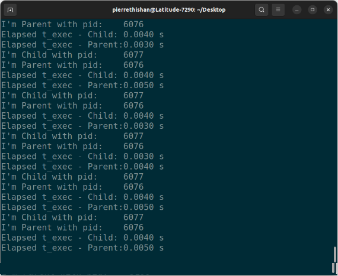
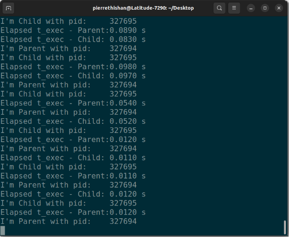

# OSL LAB-1

Team Members: Celestine Machuca.
Thishan Warnakulasooriy.
## Task 1
### Bash Script
```bash
#!/bin/bash
# GPIO pin number
gpio=136

# Export GPIO pin to userspace
echo $gpio > /sys/class/gpio/export

# Set GPIO pin as output
echo "out" > /sys/class/gpio/gpio$gpio/direction

# Toggle GPIO pin
while true; do
  echo "1" > /sys/class/gpio/gpio$gpio/value
  echo "0" > /sys/class/gpio/gpio$gpio/value
done

# Unexport GPIO pin from userspace
echo $gpio > /sys/class/gpio/unexport

```

### Measured Frequency


The measured frequency is 1.5 Khz.

### C Code
```c
#define GPIO5_START_ADDR 0x49056000
#define GPIO5_SIZE 0x00001000
#define GPIO_OE 0x034
#define GPIO_SETDATAOUT 0x094
#define GPIO_CLEARDATAOUT 0x090
#define GPIO_DATAOUT 0x03C
#define PIN 0x0100

#include <stdio.h>
#include <stdlib.h>
#include <sys/mman.h>
#include <sys/stat.h>
#include <fcntl.h>

int main(int argc, char *argv[]) {
    volatile unsigned int *gpio_oe_addr = NULL;
    volatile unsigned int *gpio_setdataout_addr = NULL;
    volatile unsigned int *gpio_cleardataout_addr = NULL;
    volatile void *gpio_addr = NULL;

    int fd = open("/dev/mem", O_RDWR | O_SYNC);
    gpio_addr = mmap(0, 4096, PROT_READ | PROT_WRITE, MAP_SHARED, fd, GPIO5_START_ADDR);

    gpio_oe_addr = gpio_addr + GPIO_OE;
    gpio_cleardataout_addr = gpio_addr + GPIO_CLEARDATAOUT;
    gpio_setdataout_addr = gpio_addr + GPIO_SETDATAOUT;

    if (gpio_addr == MAP_FAILED) {
        printf("mmap failed, %x\n", gpio_addr);
        exit(1);
    }

    *gpio_oe_addr &= ~PIN;

    int i = 0;
    while (1) {
        *gpio_setdataout_addr = PIN;
        for (i = 0; i < 10; i++) continue;
        *gpio_cleardataout_addr = PIN;
    }

    close(fd);
    return 0;
}
```

### Measured Frequency


1.4974 Mhz

## Task 2

Two approaches were perfomed

### Approach 1

As simple counter was made that runs for 30 seconds from the start time and prints the counter value to the file, together with the niceness value.

```c
#include <stdio.h>
#include <time.h>
#include <unistd.h>
#include <sys/types.h>
#include <fcntl.h>
#include <string.h>

#define MAX_TIME 30

int main(int argc, char *argv[]) {
    if (argc != 2) {
        printf("Usage: ./print_string <string>\n");
        return 1;
    }
    char *niceness = argv[1];
    long long counter = 0;
    time_t start_time, current_time;
    pid_t pid = getpid();

    // Get the start time
    time(&start_time);

    // Run for 60 seconds
    do {
        counter++;
        time(&current_time);
    } while (difftime(current_time, start_time) < MAX_TIME);

    // Generate the file name
    char file_name[50];
    snprintf(file_name, sizeof(file_name), "%d.txt", pid);

    // Write the counter value to the file
    FILE *file = fopen(file_name, "w");
    if (file == NULL) {
        printf("Error: Unable to open the file.\n");
        return 1;
    }

    fprintf(file, "counter = %lld\n", counter);
    fprintf(file, "niceness = %s\n", niceness);
    
    fclose(file);

    printf("Counter value is written to the file %s\n", file_name);

    return 0;
}

```

The process are called by a bash script that runs the process with different niceness values.

```bash

# Compile the C program
gcc -o counter counter.c

# Declare an array of niceness values
niceness_values=(0 0 0 0 0 0 0 0 0 0)

# Spawn 10 instances of the program with different niceness values
for i in "${!niceness_values[@]}"; do
    nice -n "${niceness_values[$i]}" ./counter "${niceness_values[$i]}"&
done

# Wait for all instances to finish
wait

echo "All instances have finished."

```

The results are shown in the table below.

### Results

#### Equal Niceness Values
    niceness_values=(0 0 0 0 0 0 0 0 0 0)


#### Different Niceness Values
    niceness_values=(-20 0 0 0 0 0 0 0 0 20)


### Stair Niceness Values
    niceness_values=(-20 -15 -10 -5 0 5 10 15 20 20)


### Sum of work done by test case


* Change the „nice value“ of one process by using the renice command. What’s the
effect to the output? Explain!

Process tested with niceness value of 0.

``` c
#include <stdio.h>
#include <stdlib.h>
#include <unistd.h>
#include <sys/wait.h>
#include <sys/types.h>
#include <sys/time.h>


int main() {
    pid_t pid = fork();

    if (pid < 0) {
        perror("Fork failed");
        exit(1);
    }
    
    int is_child = pid == 0;

    int iterations = 1000000;
    for (int i = 0; i < iterations; i++) {
        if (is_child) {
            putchar('x');
        } else {
            putchar('.');
        }
    }
}
        

```

Output of the process with


Timelane of the process with niceness value of 0


* Insert a waiting period of 1 ms after each output. What’s the effect to the assignment
of calculation time?



### Conclusion from Approach 1
As seen from the results, the processes with the same niceness value are executed yield about the same counter val, contrary to the case where -20 and 20 are used where there is a clear distinction between the two processes with the negative niceness value yielding a higher counter value than the positive niceness value.
A interesting side note is that the niceness did not change the total throughput of each case in a significant way, as the total work done by each case is about the same.

## Aproach 2

To create and manipulate two competing processes, we used the fork() call taught in the lectures. The idea was to create two functions that output to the screen, and track their response time (Elapsed t_exec) so as to observe how the scheduler executes them while influencing and changing the priorities(renice).

2.1 Change the nice value
A c-program with the fork() call was developed to create two competing processes, both of which write to the screen without using any stream functions.

task2a.c

```c
#include <stdio.h>
#include <stdlib.h>
#include <unistd.h>
#include <sys/wait.h>
#include <sys/types.h>
#include <time.h>
int main()
{
    pid_t pid = fork();
    clock_t start, endOfParent, endOfChild;
    if (pid < 0)
    {
        perror("Fork failed");
        exit(1);
    }
    while (1)
    {
        start = clock();


        if (pid > 0)
        { // fork() returns the parent process, the process ID of the child process.
            printf("I'm Parent with pid:\t%d\n", getpid());
            endOfParent = clock();
            printf("Elapsed t_exec - Parent:\t%.4f s\n", ((double)(endOfParent - start)) * 1e3 / CLOCKS_PER_SEC);
        }
        else if (pid == 0)
        { // fork() returns the child process, "0".
            printf("I'm Child with pid:\t%d\n", getpid());
            endOfChild = clock();
            printf("Elapsed t_exec - Child:\t%.4f s\n", ((double)(endOfChild - start)) * 1e3 / CLOCKS_PER_SEC);
        }
    }


    return 0;
}
```


Figure 1 Termial output when parent and child process’s niceness values are not changed


    Then we changed the nice value of the parent process to 10 using the renice command.


Figure 2 nice value change


Figure 3 Terminal output after nice values change 

As we can see above after the renice the parent process takes longer to finish executing because of the new lower priority.


## 2.2 The effect of a waiting period of 1 ms

usleep() was used to give a 1 ms delay after each output to the screen in the following task.

task2b.c

```c	
#include <stdio.h>
#include <stdlib.h>
#include <unistd.h>
#include <sys/wait.h>
#include <sys/types.h>
#include <time.h>
int main()
{
    pid_t pid = fork();
    clock_t start, endOfParent, endOfChild;
    if (pid < 0)
    {
        perror("Fork failed");
        exit(1);
    }
    while (1)
    {
        start = clock();


        if (pid > 0)
        { // fork() returns the parent process, the process ID of the child process.
            printf("I'm Parent with pid:\t%d\n", getpid());
            usleep(1000);
            endOfParent = clock();
            printf("Elapsed t_exec - Parent:\t%.4f s\n", ((double)(endOfParent - start)) * 1e3 / CLOCKS_PER_SEC);
        }
        else if (pid == 0)
        { // fork() returns the child process, "0".
            printf("I'm Child with pid:\t%d\n", getpid());
            usleep(1000);
            endOfChild = clock();
            printf("Elapsed t_exec - Child:\t%.4f s\n", ((double)(endOfChild - start)) * 1e3 / CLOCKS_PER_SEC);
        }
    }


    return 0;
}

```


Figure 5: Terminal output after adding a 1ms delay

As we can observe above the execution times of each process increased with a factor of closer to 10 in comparison to before. Also, we observed that the execution times of both processes are very similar now.

## 2.3 Simulatanuoesrunning of time-consuming program
Part a) of task 2 was run again but now while running a time-consuming program in the background. We can see that the execution times have slightly increased, the max being around 9ms(Figure 7).


Figure 5: Terminal output after adding a 1ms delay

## 2.3 Simulatanuoesrunning of time-consuming program

* of task 2 was run again but now while running a time-consuming program in the background. 

Part a) of task 2 was run again but now while running a time-consuming program in the background.   

    We can see that the execution times have slightly increased, the max being around 9ms(Figure 7).

Figure 6 Terminal output when only task2a.c is run




    Figure 7 Terminal output when task2a.c and the time-consuming program are run


Part b) of task 2 was run again but now while running a time-consuming program in the background. We can see that the execution times have increased and the max is now around 0.18s. This could be due to the CPU having to share its cores among the time-consuming process and the parent and child processes that print out to the terminal(Figure 9).D


Figure 8 Terminal output when only task2b.c is run


Figure 9 Termial output when task2b.c and the time-consuming program are run